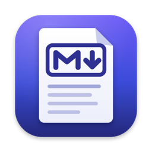
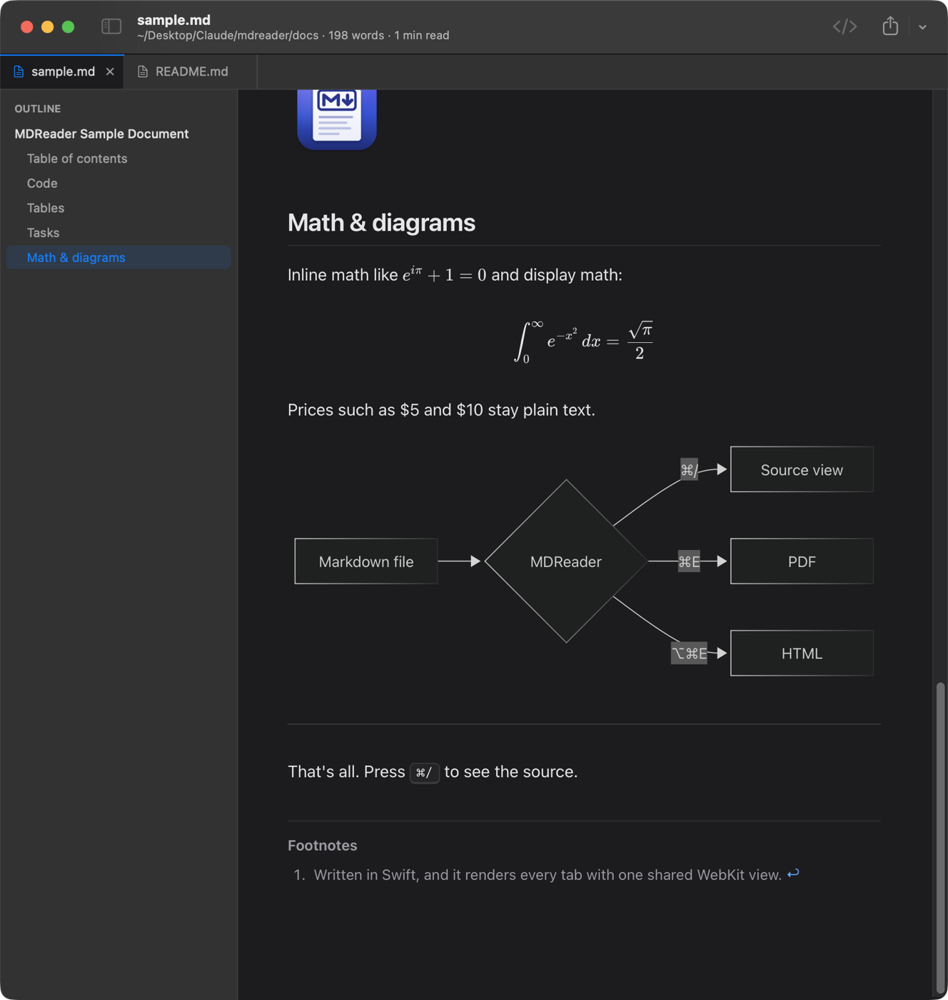

<p align="center">
  
</p>

<h1 align="center">MDReader</h1>

<p align="center">A small, fast Markdown reader for macOS. Tabs, an outline, dark mode and PDF export, and nothing else.</p>

<p align="center">
  
</p>

## Why

Most Markdown apps are editors, note-taking suites, or Electron wrappers. MDReader only **reads** Markdown, and does that well. It's a native Swift app of about 5 MB that renders every tab through one shared WebKit view and needs no network access.

## Features

**Reading**
- GitHub-flavored Markdown: tables, task lists, strikethrough, footnotes, GitHub alerts (`> [!NOTE]`), heading anchors, relative images, and a collapsible YAML front-matter block
- Syntax-highlighted code blocks with a copy button
- Math with `$inline$`, `$$display$$` or ```` ```math ```` blocks, rendered by KaTeX
- Diagrams from ```` ```mermaid ```` blocks: flowcharts, sequence, class, state, ER, Gantt, pie and more
- Math and diagram support only loads when a document uses it, so plain documents stay fast
- **Markdown source toggle**: <kbd>⌘</kbd><kbd>/</kbd> switches to the highlighted source
- **Outline sidebar** with the headings, highlighting the section you're reading (<kbd>⇧</kbd><kbd>⌘</kbd><kbd>O</kbd>)
- Word count and reading time in the title bar
- **Live reload**: the view updates when the file changes on disk, and your scroll position is kept
- **Find in page** with a match count

**Tabs**
- Editor-style tabs in the style of VS Code or Antigravity. Drag to reorder, and right-click to close others or reveal in Finder
- Reopen a closed tab with <kbd>⇧</kbd><kbd>⌘</kbd><kbd>T</kbd>. Tabs are restored on relaunch
- Links to other Markdown files open in a new tab, including links to a heading such as `guide.md#setup`

**Exporting**
- **PDF** (<kbd>⌘</kbd><kbd>E</kbd>): paginated, always in a light print theme, with a title header and page numbers, and links stay clickable. Saves to the Desktop by default
- **HTML** (<kbd>⌥</kbd><kbd>⌘</kbd><kbd>E</kbd>): one self-contained file with styles and images embedded
- **Copy as Rich Text** (<kbd>⌥</kbd><kbd>⌘</kbd><kbd>C</kbd>): paste formatted content into Mail, Notes, Pages or Google Docs

**Appearance**
- Light / Dark / System theme, sans or serif reading font, text size, and text width (narrow to full)

**Everything else**
- `mdr` command: `mdr README.md`, or `cat notes.md | mdr`
- Open files by drag & drop, from Finder's *Open With*, or from *Open Recent*
- Optional weekly check for new versions on GitHub

## Install

### Homebrew

```bash
brew install --cask rboundi/tap/mdreader
```

### Download

Download `MDReader-x.y.z.dmg` from [Releases](https://github.com/rboundi/mdreader/releases), open it, and drag **MDReader** to Applications.

> [!NOTE]
> MDReader isn't notarized, since that requires a paid Apple developer account. The first time you open it, right-click the app and choose **Open**. On recent macOS versions you may need **System Settings → Privacy & Security → Open Anyway**. You can also run:
> ```bash
> xattr -dr com.apple.quarantine /Applications/MDReader.app
> ```

### Build from source

Requires macOS 13 (Ventura) or later and the Xcode Command Line Tools (`xcode-select --install`). Xcode itself is not needed.

```bash
git clone https://github.com/rboundi/mdreader.git
cd mdreader
./build.sh --install
```

This builds the app, copies it to `/Applications`, and links the `mdr` command if `/opt/homebrew/bin` or `/usr/local/bin` is writable. You can also install `mdr` later from **MDReader → Install Command Line Tool…**.

**Make it the default app for Markdown:** select any `.md` file in Finder, press <kbd>⌘</kbd><kbd>I</kbd>, choose MDReader under **Open with**, and click **Change All…**.

## Keyboard shortcuts

| Action | Shortcut |
|---|---|
| Open | <kbd>⌘</kbd><kbd>O</kbd> |
| Close tab / reopen closed tab | <kbd>⌘</kbd><kbd>W</kbd> / <kbd>⇧</kbd><kbd>⌘</kbd><kbd>T</kbd> |
| Next / previous tab | <kbd>⌃</kbd><kbd>Tab</kbd> / <kbd>⌃</kbd><kbd>⇧</kbd><kbd>Tab</kbd> |
| Go to tab 1–8 / last tab | <kbd>⌘</kbd><kbd>1</kbd>…<kbd>⌘</kbd><kbd>8</kbd> / <kbd>⌘</kbd><kbd>9</kbd> |
| Toggle Markdown source | <kbd>⌘</kbd><kbd>/</kbd> |
| Show / hide outline | <kbd>⇧</kbd><kbd>⌘</kbd><kbd>O</kbd> |
| Export as PDF / HTML | <kbd>⌘</kbd><kbd>E</kbd> / <kbd>⌥</kbd><kbd>⌘</kbd><kbd>E</kbd> |
| Copy as Rich Text | <kbd>⌥</kbd><kbd>⌘</kbd><kbd>C</kbd> |
| Print | <kbd>⌘</kbd><kbd>P</kbd> |
| Find / next / previous | <kbd>⌘</kbd><kbd>F</kbd> / <kbd>⌘</kbd><kbd>G</kbd> / <kbd>⇧</kbd><kbd>⌘</kbd><kbd>G</kbd> |
| Reload from disk | <kbd>⌘</kbd><kbd>R</kbd> |
| Zoom in / out / actual size | <kbd>⌘</kbd><kbd>+</kbd> / <kbd>⌘</kbd><kbd>-</kbd> / <kbd>⌘</kbd><kbd>0</kbd> |
| Settings | <kbd>⌘</kbd><kbd>,</kbd> |

## Privacy

MDReader makes no network requests except:
- images that a document itself links to on the web
- the update check: one request to `api.github.com` at most once a week, which you can turn off in Settings

It sends no analytics or telemetry.

## How it works

```
Sources/MDReader/
  MDReaderApp.swift       App entry, menus and shortcuts
  AppState.swift          Tabs, opening/closing, exports, persistence
  DocTab.swift            One open file (+ FileWatcher for live reload)
  ReaderController.swift  The single shared WKWebView: rendering, printing, links
  ContentView.swift       Window layout, toolbar, find bar, empty state
  TabBar.swift            Editor-style tab strip
  OutlineView.swift       Headings sidebar
  HTMLExport.swift        Standalone HTML and rich-text clipboard
  UpdateChecker.swift     "Is there a newer release on GitHub?"
  SettingsView.swift      Preferences window
Resources/
  web/                    Page template, renderer (app.js), themes (style.css), vendored libraries
  mdr                     The command line tool
scripts/make_icon.swift   Draws the app icon in code; ./scripts/make_icon.sh rebuilds AppIcon.icns
tests/                    Renderer tests (Node + jsdom)
```

Rendering stays light because of a few choices:

- There's one `WKWebView` for the whole app. Switching tabs swaps content through JavaScript, so you never pay for a web process per tab
- Everything is bundled, and KaTeX and Mermaid are only loaded when a document needs them
- Raw HTML inside Markdown is sanitized: scripts, iframes, and event handlers are removed, and a Content-Security-Policy is applied

## Development

```bash
./build.sh                             # build the .app into ./build
open build/MDReader.app docs/sample.md
cd tests && npm install && npm test    # renderer tests
```

`docs/sample.md` exercises every rendering feature. See [CONTRIBUTING.md](CONTRIBUTING.md) for how the project is organized and how releases work.

## License

MIT. See [LICENSE](LICENSE). Bundled third-party libraries are listed in [THIRD_PARTY_NOTICES.md](THIRD_PARTY_NOTICES.md).
