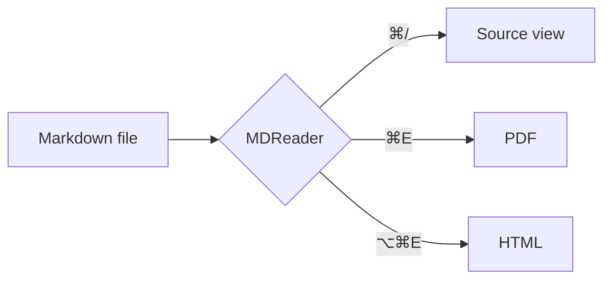

# MDReader Sample Document

A **lightweight** Markdown reader for macOS.[^native] It renders *GitHub-flavored* Markdown, with `inline code`, [links](https://github.com), and ~~strikethrough~~.

> [!NOTE]
> Alerts like this one render the way they do on GitHub.

> [!WARNING]
> Careful — this is a warning.

## Table of contents

- [Code](#code)
- [Tables](#tables)
- [Tasks](#tasks)
- [Math & diagrams](#math--diagrams)
- [Keyboard shortcuts in the README](../README.md#keyboard-shortcuts), which opens in a new tab at that section

## Code

```swift
struct Greeting {
    let name: String
    func say() -> String { "Hello, \(name)!" }  // comment
}
```

```bash
./build.sh --install
```

## Tables

| Feature | Status | Notes |
|:--------|:------:|------:|
| Tabs | ✅ | Drag to reorder |
| PDF export | ✅ | Desktop by default |
| Dark mode | ✅ | System / Light / Dark |

## Tasks

- [x] Render Markdown
- [x] Toggle source view
- [ ] World domination

1. First
2. Second
   - Nested bullet
   - Another one

> A regular blockquote with a bit of text to show the styling.

<kbd>⌘</kbd> + <kbd>E</kbd> exports to PDF.


## Math & diagrams

Inline math like $e^{i\pi} + 1 = 0$ and display math:

$$
\int_0^\infty e^{-x^2}\,dx = \frac{\sqrt{\pi}}{2}
$$

Prices such as $5 and $10 stay plain text.



---

That's all. Press <kbd>⌘/</kbd> to see the source.

[^native]: Written in Swift, and it renders every tab with one shared WebKit view.
